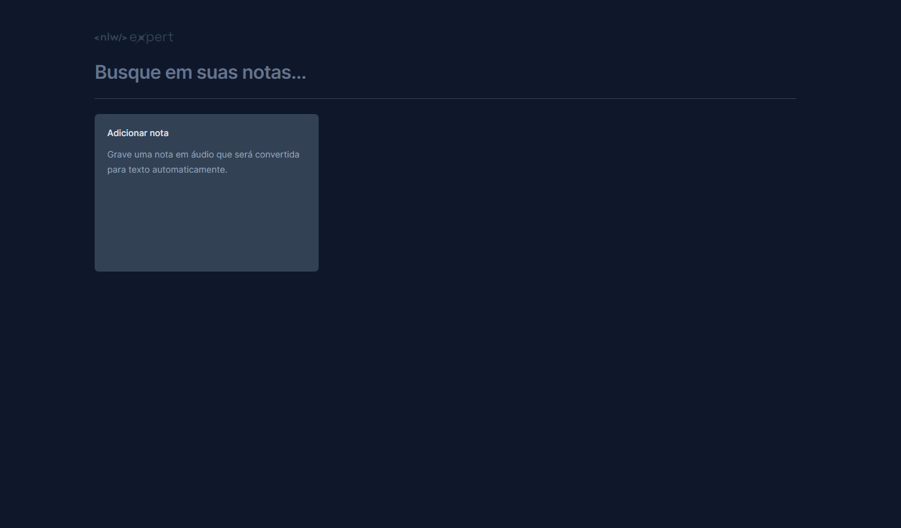

  

Aplicação desenvolvida no NLW Expert da Rocketseat na trilha React. 

 

  

## 💻 Projeto

Desenvolvimento de uma aplicação front-end em ReactJS, aplicação dos conceitos de Propriedades,
Estados e Componentes, tipagem com Typescript, tooling com Vite, interface responsiva com TailwindCSS, uso de APIs
da Web como Web Storage e Web Speech.

A Aplicação é uma app de notas onde vai conseguir grabar suas notas utilizando o uso das APIs da Web como Web Storage e Web Speech para salvar as notas e salvar o audio delas. 

Foram aplicadas as 4 Bases de React 

- Componentização 
- Propriedades 
- Estados ( podendo estes armazenar valores primitivos, booleanos e objetos)
- Lidar com Eventos de Usuarios

 

## 🚀 Tecnologias

Esse projeto foi desenvolvido com as seguintes tecnologias:

- radix-ui
- date-fns
- lucide-react
- sonner -> Biblioteca para adicionar alertas na tela - Toaster 

## 🔗 Deploy 

![github(https://img.shields.io/badge/github-000000?style=for-the-badge&logo=github&logoColor=white)(https://github.com/Jose26362780/NLW_EXPERT_TRILHA_REACT)]
![netlify(https://img.shields.io/badge/Netlify-00C7B7?style=for-the-badge&logo=netlify&logoColor=white)(https://nlw-expert-trilha-react.netlify.app/)]

## 🔗 My Links

## 📝 Licença

Esse projeto está sob a licença MIT.